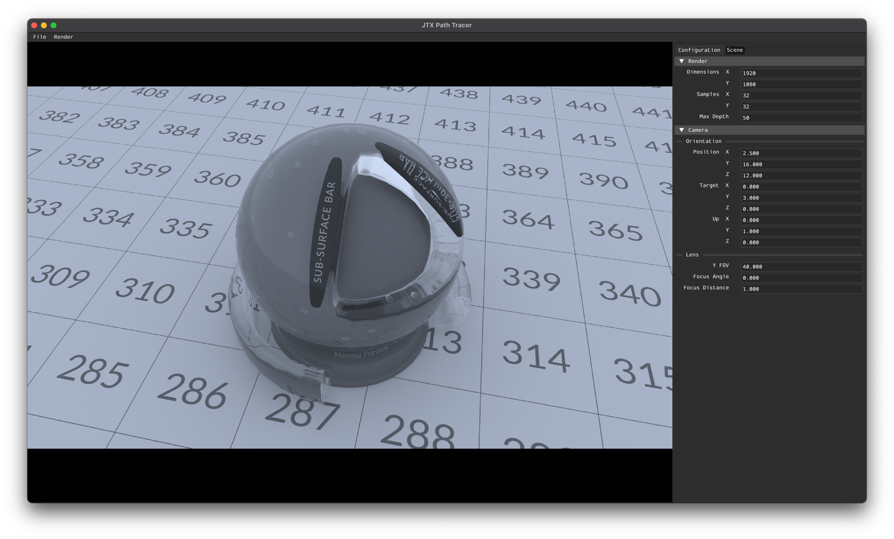

# JTX Path Tracer

This my WIP toy path tracer written in C++.

TODO:
 - QBVH (WIP): https://github.com/jebikoh/simd-bvh
 - Deferred Sorted Shading (with vectorization)
 - CUDA/OptiX Implementation (WIP)
 - glTF shading model
 - Disney shading model
 - Debug views

https://github.com/user-attachments/assets/4b746f1b-bf9e-4343-ab8d-3f99a952089c

